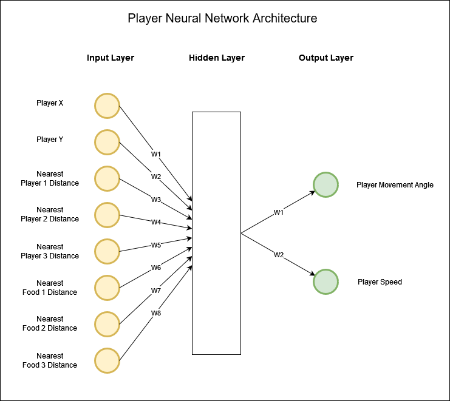
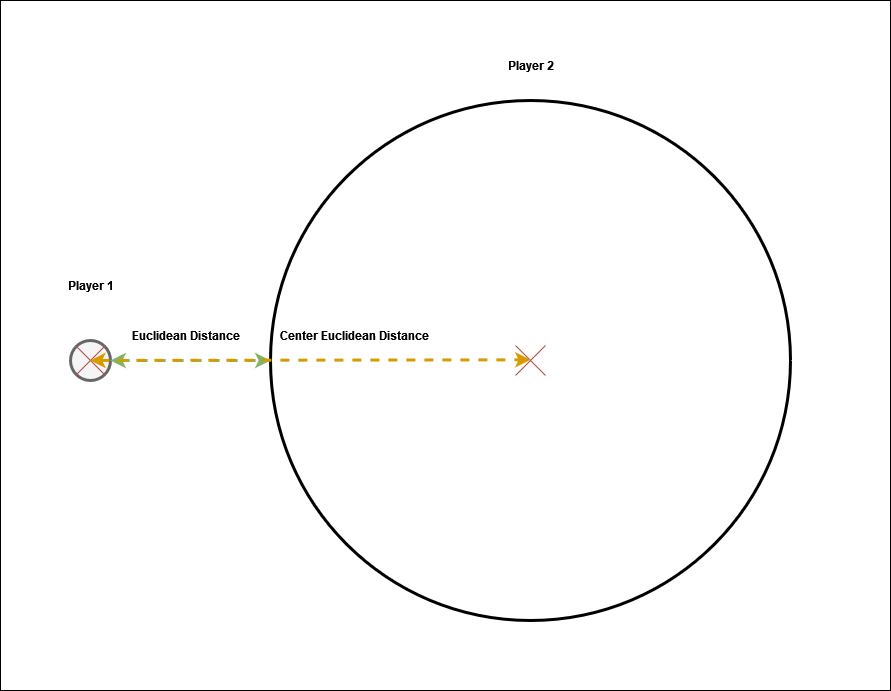

# Sentient Blobs

Sentient Blobs is a clone of [agar.io](https://agar.io) where each player is a neat ai agent with their own neural network. The neural network of a player dictates how the player interacts with the game environment. The goal for each player is to eat as much food and as many players as they can.  

<!--  -->

Although there are some deep technical concepts at work in this project, I'll do my best in this README to convey the relevant information in plain english (I know how painful it is when greeted with technical documentation littered with niche terminology).
## Setup

1. Setup virtual environment
    - Create a virtual environment: `virtualenv .venv`
    - Activate the virtual environment: `.venv\Scripts\activate`
2. Install the required dependencies: `pip install -r requirements.txt`

That's it!

To train agents to play sentient_blobs: `python train_agents.py`

To preview the trained agents playing sentient_blobs: `python main.py`

## How do the player agents learn to play?
Using the rules of NEAT (Neuro-Evolution of Augmenting Topologies), each player's neural network is initialised with random weight values. In the context of NEAT, the term 'neural network' and 'genome' are synonymous.

Each player's genome has 8 input nodes, a single hidden layer with a random number of hidden nodes and 2 output nodes. Throughout the training process, the NEAT algorithm will change the weight values of the connection genes within the network in an attempt to better achieve the goal of getting the highest score.

### Player Genome Configuration
The fitness criterion is 'max' because we want positive reinforcement in the breeding process between generations to be largely players with a higher score (thus, a higher fitness).

<!-- #### DefaultStagnation -->

## Fitness Function
<!-- This will have to be updated in accordance with the fitness function being changed -->
The fitness function is the arguably the most fundamental part in the training process as it defines how well a player has played the game. The fitness of player is simply dictated by their score. Each player loses 0.2% of their score every frame which encourages them to be more proactive in consuming nearby players.

The higher the fitness score, the more likely the player is going to breed into the next generation in the training process.

## How was this project built?
Using the python programming languag, pygame library and the neat-python library.

## Challenges faced
- Deploying the game to web
- Efficiently defining genome inputs
- Defining whether ideas were practical/useful
- Identifying an efficient design architecture for this type of project
- Defining the optimal configuration settings for the genomes 
    - I think this was largely due to lack of knowledge for each setting; I couldn't understand the effect some settings would have on the genomes during training

## Lessons learned
- To research and define whether the original intent/purpose of a project is possible to achieve
    - In this case, it was quickly discovered pygame was a desktop application library which wasn't really built with web deployment in mind; thus the technologies used for this project wasn't fully fit for purpose
- To re-evaluate the project plan often
- To log scope-creep ideas rather than spontaneously applying them during the development process of the foundational idea(s)
    - This slows down the progress of development in the long run
- To identify whether specific ideas / features are possible to implement before trying to develop them.
    - E.g. Find out whether things are possible before investing a couple hours to stumble into a brick wall of "this isn't possible"

## Deployment 
Since the game was made using the Pygame library, the only viable way I could find to deploy it to web was using pygbag. Pygbag is a library that allows pygame to be run in the browser. The only downside is that it is slow but also limited with regards to certain features that would work in pygame but not in pygbag. E.g. File drag and drop.

Moreover, the neat-python library isn't really supported as it reads the 'neat' import within the main.py file. However, the workaround was downloading the neat-python source files and importing them ALL directly into main. Sorted. I believe this small workaround and discovery will unlock a lot of potential for pygame games to be deployed to the web with neat ai.

## Citations
- [Neataptic](https://wagenaartje.github.io/neataptic/articles/agario/)
- [neat-python](https://neat-python.readthedocs.io/en/latest/)
- [pygame](https://pypi.org/project/pygame/)

## Worthy mentions
Gibbosauras; Aka, marc

## TODO
- Be able to enable/disable a draw lines function from the nearest three players and three food (different colour lines depending on the type of 'particle')
- Train on larger population
- Input the nearest player sizes

The current approach gives the player the distance between itself and the nearest three players... with no indication on how large those other players are. So how would the players know when they are able to eat each other. 

I don't know whether I should calculate the euclidean distance between this player's center and the other player's center (this needs to be calculated)... Or! Providing the player with a boolean value determined by whether if this player's radius is larger than the other player's radius (which isn't a big calculation at all as we're just checking if one value is larger than the other.)

